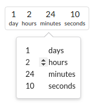
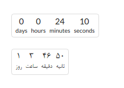

# jquery-duration-picker

This is a small library for picking time durations in javascript.

I wrote this to use in Quera (https://quera.ir).

## Example





## Installation

```
bower install jquery-duration-picker
```

## Usage

```html
<script type="text/javascript" src="bower_components/jquery/dist/jquery.min.js"></script>
<link rel="stylesheet" href="bower_components/semantic/dist/semantic.min.css"/>
<script type="text/javascript" src="bower_components/semantic/dist/semantic.min.js"></script>
<script type="text/javascript" src="dist/jquery-duration-picker.min.js"></script>
<link rel="stylesheet" href="dist/jquery-duration-picker.min.css"/>
```

```js
$('.duration-picker').duration_picker();

// or

$('.duration-picker').duration_picker({
    lang: 'en',  // can be 'en', 'fa'
    formatter: some_function // a function that gets numbers displayed in input and returns a formatted one
});
```
